# Visual Pollution Object Detection

------

This project aims to build a new field of automated visual pollution classification.

In this project, I trained a custom model using Tensorflow Object Detection API version 2 on Google Colab to detect and classify 10 types of visual pollution on street imagery taken from a moving vehicle in Saudi Arabia.

Note: in this repository, I am providing a summary of some of the model training steps, and I have demonastrted the entire model training steps in detail in this [visual pollution object detection](https://github.com/kalthommusa/Visual-Pollution-Object-Detection/blob/master/visual_pollution_object_detection.ipynb) jupyter notebook.

## Visual pollution types:

1- BAD BILLBOARD 

2- BROKEN_SIGNAGE 

3- CLUTTER_SIDEWALK 

4- CONSTRUCTION ROAD 

5- FADED SIGNAGE 

6- GARBAGE

7- GRAFFITI

8- POTHOLES 

9- SAND ON ROAD

10- UNKEPT_FACADE

## Technology and tools used:

* Google Colab

* Python 3.8.10

* TensorFlow 2.11.0

* Tensorflow 2 object detection API

# Project steps/pipline:

* ## 1- Data preparation

I used a dataset collected and created by SDAIA (at Smartathon Hackathon). The dataset features the raw sensor camera inputs as perceived by a fleet of multiple vehicles in a restricted geographic area in KSA.
In this project, I took a subset(700 images) from the large dataset, then divided them into 500 images to feed into the model for the training phase and 200 images for the testing phase.

CSV annotation files (train.csv and test.csv) were delivered by SDAIA (at Hackathon). Although I didn't need to do the annotations myself, there was a problem with the coordinates of the bounding boxes where they weren't capturing the detected objects correctly, so I had to correct the bounding box annotations by multiplying them by 2. ([in this Pre-process the dataset jupyter notebook](https://github.com/kalthommusa/Visual-Pollution-Object-Detection/tree/master/preprocessing-dataset))

* ## 2- Model training

I trained the custom model using fine-tuning technique(transfer learning). I chose the pre-trained ``ssd_mobilenet_v2_fpnlite_320x320_coco17`` model checkpoint (that has been trained on the COCO dataset) as a starting point to train my model.

I made the following changes to the model pipeline config file:

* Changed ``num_classes`` to ``num_classes: 10``

* Changed ``fine_tune_checkpoint`` to ``fine_tune_checkpoint: "/content/drive/MyDrive/visual-pollution-object-detection/data/ssd_mobilenet_v2_fpnlite_320x320_coco17_tpu-8/checkpoint/ckpt-0"``

* Changed ``fine_tune_checkpoint_type`` to ``fine_tune_checkpoint_type: "detection"``

* Changed ``batch_size`` to ``batch_size: 24``

(Note: batch_size = 128 and 64 give me an error in google colab)

* Changed ``num_steps`` to ``num_steps: 2000``

* Changed ``label_map_path`` to ``label_map_path: "/content/drive/MyDrive/visual-pollution-object-detection/data/label_map.pbtxt"``

* Changed ``input_path`` to ``input_path: "/content/drive/MyDrive/visual-pollution-object-detection/data/train.record"``

* Changed ``label_map_path`` to ``label_map_path: "/content/drive/MyDrive/visual-pollution-object-detection/data/label_map.pbtxt"``

* Changed ``input_path`` to ``input_path: "/content/drive/MyDrive/visual-pollution-object-detection/data/test.record"``

(Note: I trained the model on 700 images for 2000 steps, thus the training process took 10 hours on google colab)

* ## 3- Model testing 

Below are some of the model predictions on images to show the model performance:

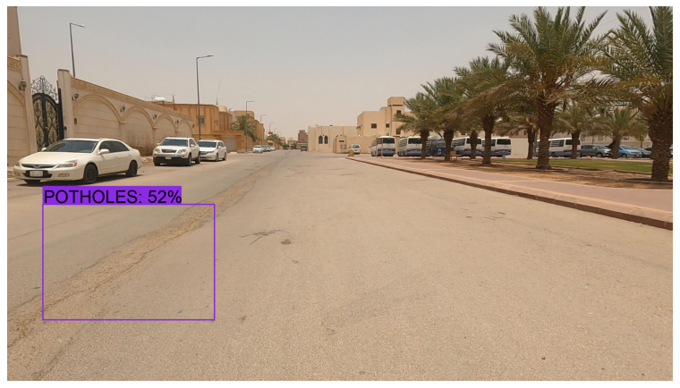
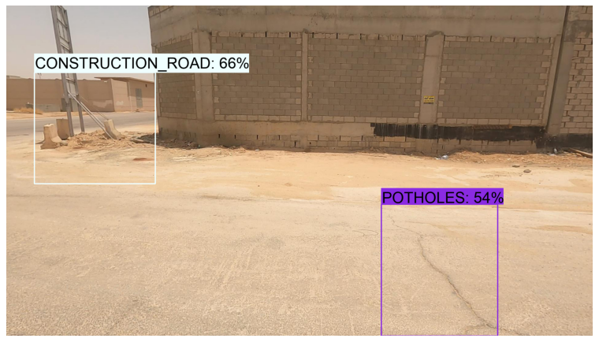
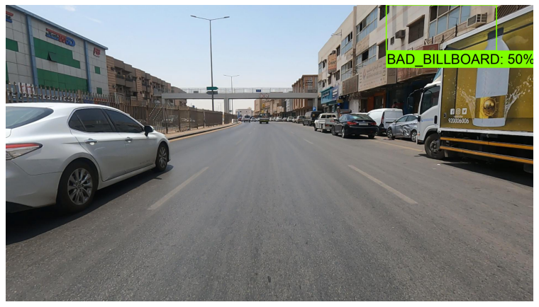
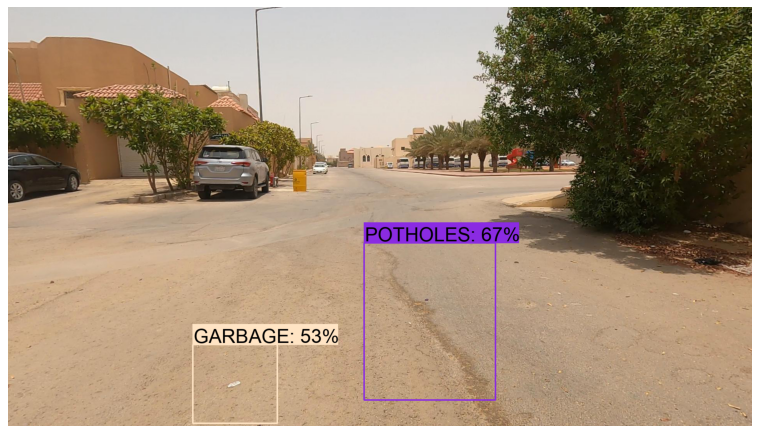
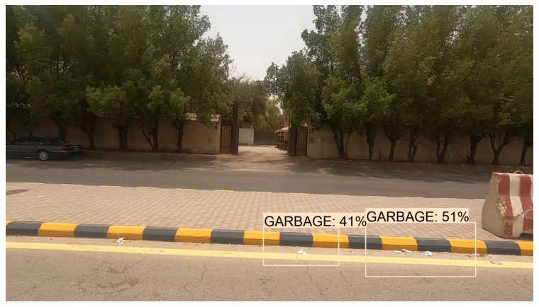
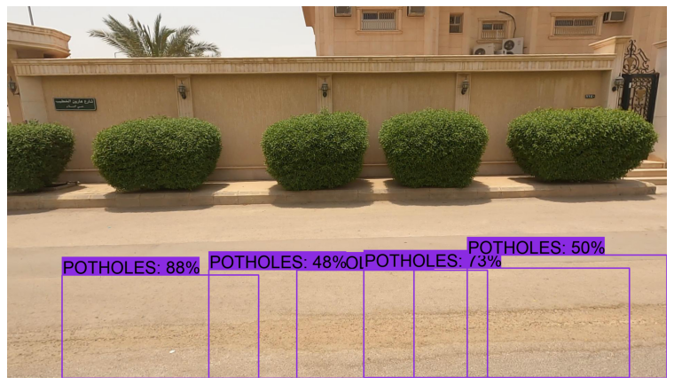
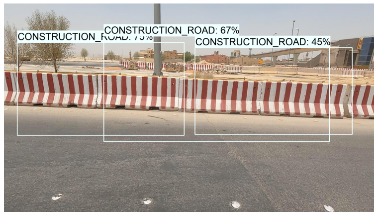
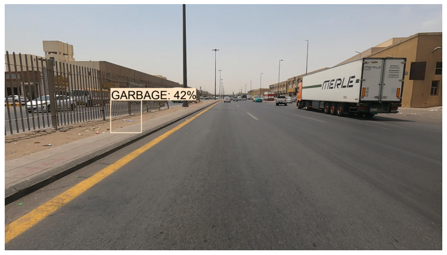
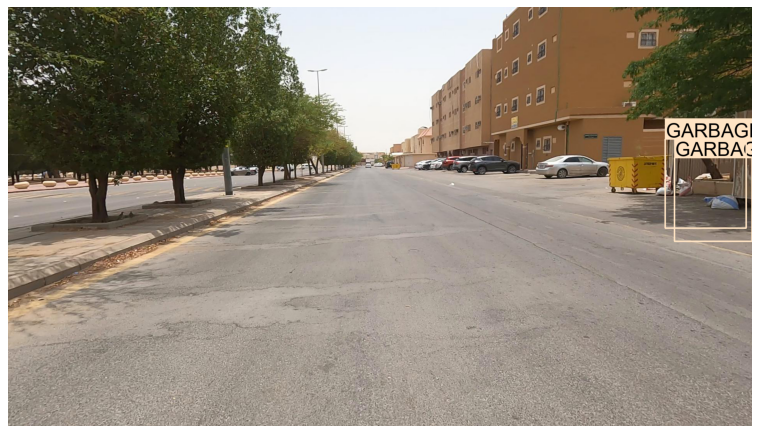
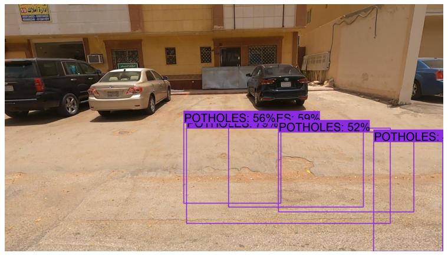
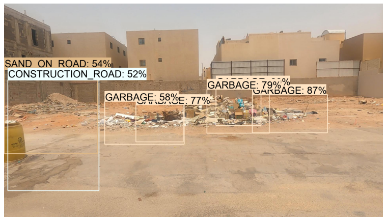
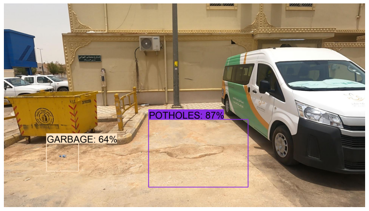
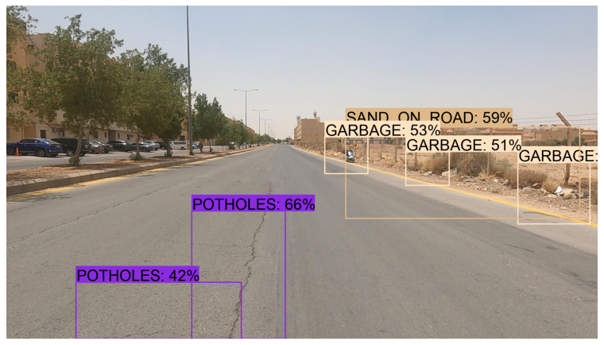

## Observation
As we can see, the outcome of the custom model (that trained on 700 images on 2000 steps) is acceptable.

## Future work
To enhance the model's accuracy, I would suggest increasing the size of the dataset and training the model for more than 2000 steps.

